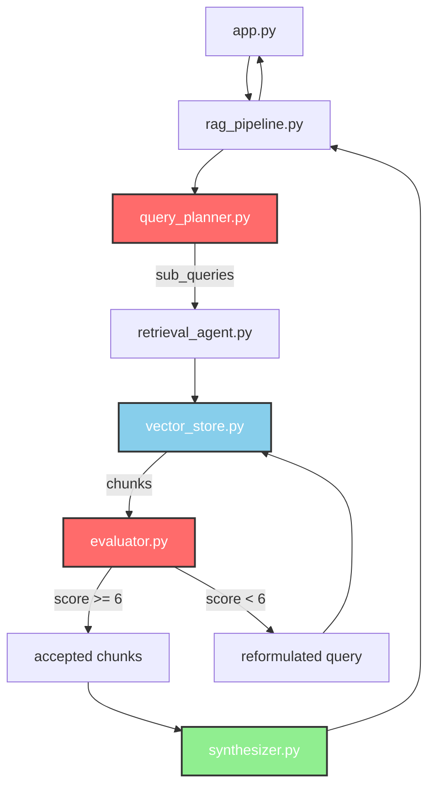

```mermaid
flowchart TD
    A[app.py] --> B[rag_pipeline.py]

    B --> C[query_planner.py]
    C -->|sub_queries| D[retrieval_agent.py]

    D --> E[vector_store.py]
    E -->|chunks| F[evaluator.py]

    F -->|score >= 6| G[accepted chunks]
    F -->|score < 6| H[reformulated query]
    H --> E

    G --> I[synthesizer.py]
    I --> B
    B --> A

    style C fill:#ff6b6b,stroke:#333,stroke-width:2px,color:#fff
    style F fill:#ff6b6b,stroke:#333,stroke-width:2px,color:#fff
    style I fill:#90EE90,stroke:#333,stroke-width:2px,color:#fff
    style E fill:#87CEEB,stroke:#333,stroke-width:2px,color:#fff
```